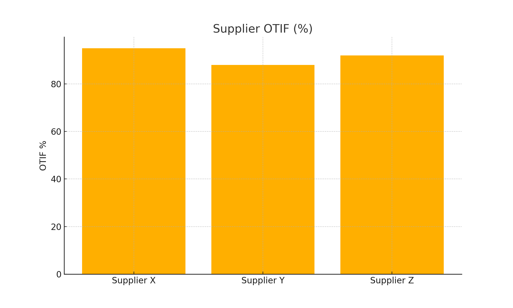
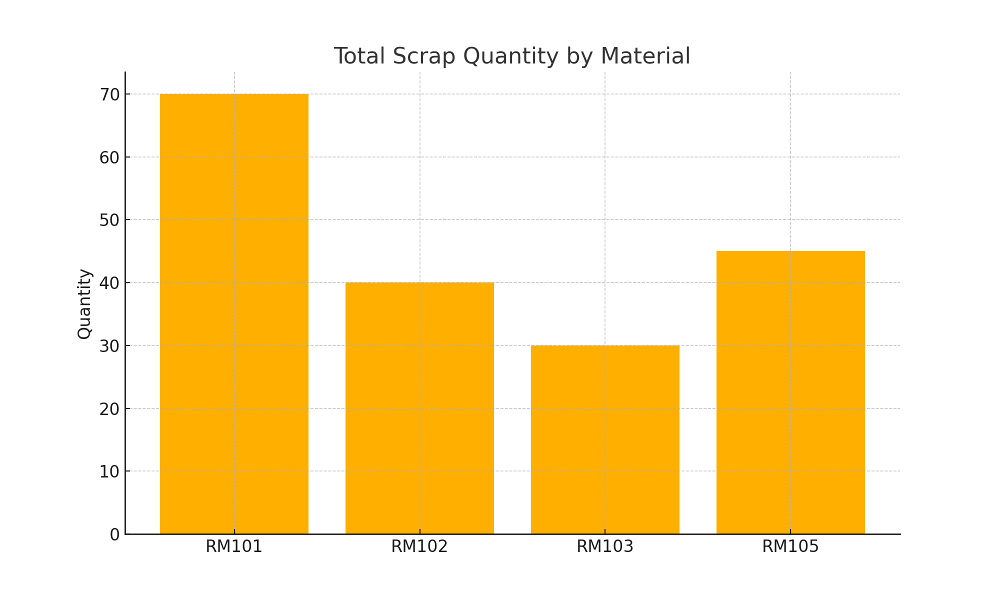
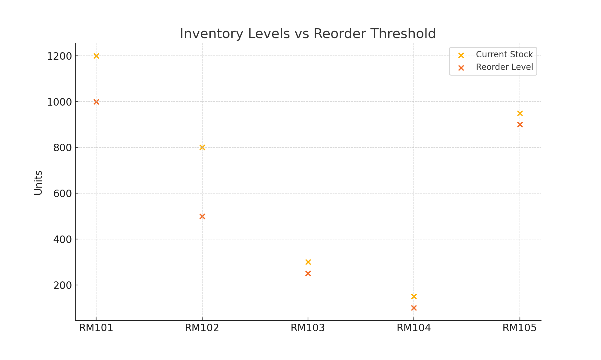

# Biotech Supply Chain Dashboard & Risk Analyzer

---

## 👤 About Me

Hi, I'm **Naveen Dadi** — a data-driven professional with a Master's in Business Analytics and **5+ years of experience** in Data Analytics, Business Analytics, supply chain analytics, program management, and reporting automation. I've worked with organizations like Amazon, NYU, and Infosys, using tools like Power BI, Python, SQL, and Salesforce to drive operational improvements.

This project reflects my passion for applying analytics in real-world operations — especially in fast-paced, regulated industries like **biotech** and **manufacturing**. I created this end-to-end simulation to showcase how I approach supply chain challenges with data, automation, and dashboards.

📫 [LinkedIn](https://www.linkedin.com/in/naveendadi/)  
📧 dnave1@unh.newhaven.edu  
📞 +1 (203) 589-9774

---

## 🧠 What, Why, How — and How It Helps Clients

### ✅ What  
A data-driven supply chain analytics project that simulates core operations in a biotech company: supplier management, scrap tracking, inventory control, and BOM readiness for new product introductions.

### 🎯 Why  
To demonstrate how I would approach supply chain analysis in a highly regulated, high-performance industry using real metrics, dashboards, and actionable insights.

### ⚙️ How  
- Created sample data for suppliers, materials, scrap logs, and purchase orders  
- Used Python to analyze scrap trends and supplier reliability  
- Built Power BI visuals to track KPIs like OTIF, lead time, scrap %, and inventory vs reorder thresholds  
- Documented the entire workflow for easy understanding and scaling

### 🧪 How It Helps a Biotech Client  
- Improves supply visibility and reduces risk of disruptions  
- Supports compliance with expiry and inventory controls  
- Highlights supplier issues early using scorecards and dashboards  
- Prepares supply chain teams for NPI launches through BOM tracking  
- Enables decision-making with visual, real-time KPIs

---

## 📂 Repository Structure

```
data/                
images/               
scripts/               
dashboard/           
README.md  
requirements.txt
```

---

## 📊 Sample Visuals

Below are quick matplotlib previews of the insights you’ll build in Power BI.

| Supplier OTIF | Scrap by Material | Inventory vs Reorder |
|---------------|------------------|----------------------|
|  |  |  |

---

## 🚀 Getting Started

1. **Clone the repo**  
   ```bash
   git clone https://github.com/dadinaveen1729/Biotech-SupplyChain-Analyzer.git
   ```

2. **Install Python requirements (optional)**  
   ```bash
   pip install -r requirements.txt
   ```

3. **Open Power BI Desktop**  
   - Get Power BI Desktop (free) from Microsoft Store  
   - Load CSVs from the `/data/` folder  
   - Build visuals like the ones shown above using built-in charts

4. **Publish or Export**  
   - Publish to Power BI Service  
   - Or export your dashboard as PDF  
   - Save `.pbix` file in `/dashboard/` folder

---

## ✨ Features You Can Extend

- Supplier scorecards with lead‑time and defect KPIs  
- Scrap risk alerts (DAX)  
- Expiry countdown slicers  
- Forecasting visual for POs  

---

## 📜 License

MIT
